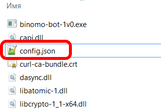
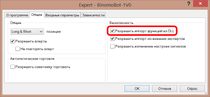
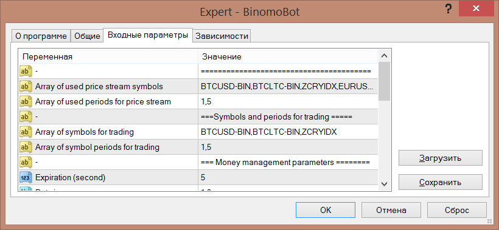
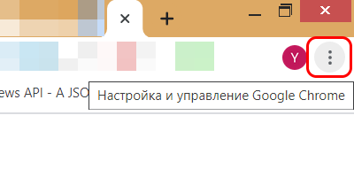
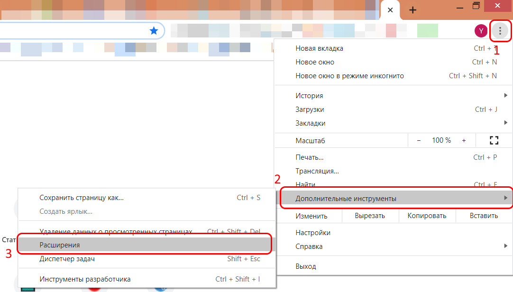
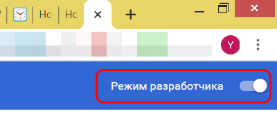
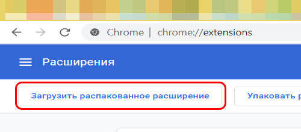
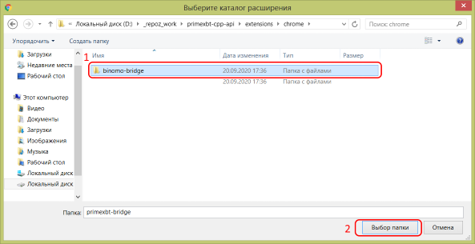
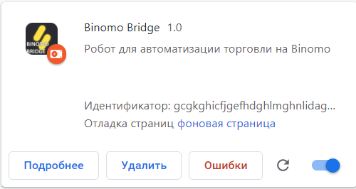

# binomo-bot
Bot for trading with a broker https://binomo.com/

## Description

The bot is a "bridge" between MT4 and **binomo** broker. Also, the robot can open trades using hot keys and deliver a stream of quotes to MT4 for any symbols and periods in the form of an offline graph.

List of available currency pairs:

```
ZCRYIDX		
AUDNZD		
GBPNZD		
EURNZD		
EURMXN		
EURIDX		
JPYIDX		
EURUSD		
CRYIDX		
BTCLTC		
AUDUSD		
AUDCAD		
EURJPY		
AUDJPY		
USDJPY	
USDCAD	
EURCAD(OTC)	
NZDUSD		
GBPUSD	
XAUUSD
USDJPY(OTC)	
GBPUSD(OTC)	
EURUSD(OTC)	
USDCHF	
AUDCAD(OTC)	
BTCUSD	
GBPJPY(OTC)	
CHFJPY	
NZDJPY	
```

**ВAttention! MT4 does not support charts with more than 6 decimal places, so the bot automatically reduces the accuracy of quotes to 6 decimal places.**

## Installing the bot and configuring the bot

Unpack the *binomo-bot-1v3.zip* archive and place the *binomo-bot-1v3* folder in any convenient place on your computer or server.
For the robot to start working, you just need to run the **binomo-bot-1v3.exe** program.

If you install the extension from the *extensions* folder in the *Google Chrome* browser and open the page with the broker,
then the bot can also make transactions.

The bot can open deals by pressing keys on the keyboard or by signals from MT4.
To receive signals from MT4, install the *BinomoBot.ex4* Expert Advisor and specify your indicator in it.
The Sovtenik *BinomoBot.ex4* will connect to the program *binomo-bot-1v3.exe* and open trades with the broker through it.
To test the work of the Sovtenik and the program, you can use the *TestBufferSignal.ex4* test indicator.

Before you can start using the *binomo-bot-1v3.exe* bot, you need to configure it. All bot settings are stored in the *config.json* file.

### Bot setup

At the time of launch, the bot looks for the **config.json** file, which is located in the program folder. The ** config.json ** file contains a [json structure](https://json.org/json-en.html) that defines the bot's settings.



The bot settings in the **config.json** file look something like this:

```json
{
	"binomo": {
		"port": 8082,
		"demo": true,
		"sert_file": "curl-ca-bundle.crt",
		"cookie_file": "binomo.cookie"
	},
	"bot": {
		"named_pipe": "binomo_api_bot",
		"delay_bets_ms": 0
	},
	"quotes": {
		"path": "C:\\Users\\user\\AppData\\Roaming\\MetaQuotes\\Terminal\\2E8DC23981084565FA3E19C061F586B2\\history\\Weltrade-Live",
		"symbol_hst_suffix":"-BIN",
		"max_precisions": 6,
		"volume_mode":2,
		"candles": 1440,
		"symbols": [
			{
				"symbol":"ZCRYIDX",
				"period":60
			},
			{
				"symbol":"BTCUSD",
				"period":60
			},
			{
				"symbol":"BTCLTC",
				"period":60
			},
			{
				"symbol":"AUDNZD",
				"period":60
			},
			{
				"symbol":"GBPNZD",
				"period":60
			},
			{
				"symbol":"EURNZD",
				"period":60
			},
			{
				"symbol":"EURCAD(OTC)",
				"period":60
			},
			{
				"symbol":"EURUSD(OTC)",
				"period":60
			}
		],
		"use": true
	},
	"hotkeys": {
		"keys":[
			{
				"key": "Ff",
				"symbol": "ZCRYIDX",
				"amount": 1.0,
				"duration": 60,
				"direction": -1
			}
		],
		"use": true
	}
}
```

All settings are divided into categories for convenience

#### Broker settings

The following json object is responsible for broker settings:

```
"binomo": {
	"port": 8082,
	"demo": true,
	"sert_file": "curl-ca-bundle.crt",
	"cookie_file": "binomo.cookie"
}
```

* port - Port of the bot's websocket server. The browser extension will connect to this port.
* demo - Flag of the demo account. Specify false for trading on a real account, otherwise true
* sert_file - Certificate file, leave unchanged
* cookie_file - Cookies file, leave unchanged

#### Bot settings

The following json object is responsible for the bot settings:

```
"bot": {
	"named_pipe": "binomo_api_bot",
	"delay_bets_ms": 0
}
```

* named_pipe - Name of the named pipe. This channel is needed for communication between a bot and an advisor in MT4. ** The parameter is not used in the current implementation. **
* delay_bets_ms - Delay between trades. This parameter does not work in this version.

#### Quotes stream settings

The following json object is responsible for setting the flow of quotes:

```
"quotes": {
	"path": "C:\\Users\\user\\AppData\\Roaming\\MetaQuotes\\Terminal\\2E8DC23981084565FA3E19C061F586B2\\history\\Weltrade-Live",
	"symbol_hst_suffix":"-BIN",
	"max_precisions": 6,
	"volume_mode":2,
	"candles": 1440,
	"symbols": [
		{
			"symbol":"ZCRYIDX",
			"period":60
		},
		{
			"symbol":"BTCUSD",
			"period":60
		},
		{
			"symbol":"BTCLTC",
			"period":60
		},
		{
			"symbol":"EURUSD(OTC)",
			"period":60
		}
	],
	"use": true
}
```

* path - Path to the folder where MT4 stores the quotes files. This is usually the <data directory> \ history \ <broker server name> folder. The data catalog can be opened from MT4 by clicking "File-> Open Data Catalog". ! [doc / config-instruction-1.png] (doc / config-instruction-1.png)! [doc / config-instruction-2.png] (doc / config-instruction-2.png)! [doc / config-instruction-3.png] (doc / config-instruction-3.png)
* symbol_hst_suffix - Suffix for the names of the quotes files for MT4. It is necessary that the binomo quotes files can be distinguished from other quotes. The file name is formed like this: symbol name + suffix. For example: 'BTCUSD' + '-BIN' = 'BTCUSD-BIN'
* max_precisions - The maximum number of decimal places. MT4 cannot work with a value greater than 6, leave it unchanged.
* volume_mode - Volume mode. 0 - no tick volume, 1 - tick volume calculation as number of ticks, 2 - tick volume calculation as weighted tick count.
* candles - The number of bars of historical data.
* symbols - Array of streams of quotes. This parameter is needed to configure the bot's subscription to the quotes stream. Each element of the array contains two parameters: symbol and period, where the first parameter is * symbol name *, and the second parameter is the bar period * in seconds * (60 is 1 minute).
* use - A flag that determines whether to use the quotes stream or not.

#### Hotkey settings

The following json object is responsible for setting the flow of quotes:

```
"hotkeys": {
	"keys":[
		{
			"key": "Ff",
			"symbol": "ZCRYIDX",
			"amount": 1.0,
			"duration": 60,
			"direction": -1
		}
	],
	"use": true
}
```

* keys - Array of hotkeys, contains structures with settings
* use - Flag that determines whether to use hotkeys or not

```
{
	"key": "Ff",
	"symbol": "ZCRYIDX",
	"amount": 1.0,
	"duration": 60,
	"direction": -1
}
```

* key - This is a string in which you can list multiple keys. In the example, these are f and shift + f.
* symbol - The name of the symbol where the bet will be instantly opened
* amount - the size of the bet
* duration - Duration of the binary option in seconds
* direction - direction of the bet (1 - BUY, -1 - SELL)

### Bot launch

After the settings in the **config.json** file are correct, you can run the program.
After launching, the program will automatically update the files of quotes for auto-new charts in MT4 and open trades based on signals from the advisor or from hot keys.

## MT4 Expert Advisor Settings

**BinomoBot** Expert Advisor requires permission to use *dll libraries* for its work.



In the parameters of the advisor, you need to list the list of currency pairs used by the bot, for example *BTCUSD-BIN, BTCLTC-BIN*, and also specify all used periods, for example *1.5* for timeframes of 1 and 5 minutes.



## Installing a browser extension

The * extensions \ chrome * archive folder contains the * binomo-bridge * browser extension.


* Install the extension. To do this, click the button in the upper left corner "Customize and manage Google Chrome" (three dots).



* Next, click "More Tools" -> "Extensions"



* To install an extension, you must first enable developer mode. Click the button in the upper right corner.



* Next, click in the upper left corner "Download unpacked extension"



* Select the folder with the extension and click "Select folder"



* Now the extension is installed and you can start running the program. If you need to change the port of the ** websocket-server **, click on the extension box and change the port in the settings (by default 8082).



