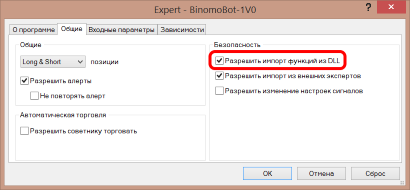
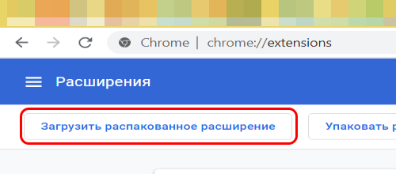
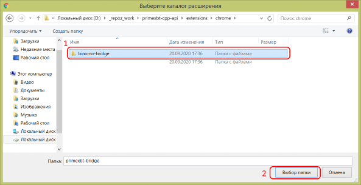

# binomo-bot
Бот для торговли у брокера https://binomo.com/

## Возможности бота

Бот представляет из себя "мост" между MT4 и брокером **binomo**. Также робот может открывать сделки по горячим клавишам и поставлять поток котировок в МТ4 для любых символов и периодов в виде автономного графка.

Список доступых валютных пар:

```
ZCRYIDX		
AUDNZD		
GBPNZD		
EURNZD		
EURMXN		
EURIDX		
JPYIDX		
EURUSD		
CRYIDX		
BTCLTC		
AUDUSD		
AUDCAD		
EURJPY		
AUDJPY		
USDJPY	
USDCAD	
EURCAD(OTC)	
NZDUSD		
GBPUSD	
XAUUSD
USDJPY(OTC)	
GBPUSD(OTC)	
EURUSD(OTC)	
USDCHF	
AUDCAD(OTC)	
BTCUSD	
GBPJPY(OTC)	
CHFJPY	
NZDJPY	
```

**Внимание! МТ4 не поддерживает графики с количеством знаков после запятой больше 6-ти, поэтому бот автоматически уменьшает точность котировок до 6 знаков.**

## Установка бота и настройка бота

Распакуйте архив binomo-bot-1v3.zip и поместите папку binomo-bot-1v3 в любое удобное место на вашем компьютере или сервере.
Чтобы робот начал работать, нужно лишь запустить программу **binomo-bot-1v3.exe**.

Если в браузер *Google Chrome* устаноить расширение из папки *extensions* и открыть страницу с брокером,
то бот сможет также соврешать сделки.

Бот может открывать сделки по нажатию клавиш на клавиатуре или по сигналам из МТ4.
Для получения сигналов из МТ4 установите советника *BinomoBot.ex4* и укажите в нем свой индикатор.
Совтеник *BinomoBot.ex4* подключится к программе *binomo-bot-1v3.exe* и будет через нее открывать сделки у брокера.
Для проверки работы совтеника и программы можно воспользоваться тестовым индикатором *TestBufferSignal.ex4*.

Прежде, чем начать использовать бота *binomo-bot-1v3.exe*, необходимо его настроить. Все настройки бота хранятся в файле *config.json*.

### Настройка бота

Бот в момент запуска ищет файл **config.json**, который расположен в папке с программой. Файл **config.json** содержит [json структуру](https://json.org/json-ru.html), которая определяет настройки бота.


Настройки бота в файле **config.json** выглядят примерно так:

```json
{
	"binomo": {
		"port": 8082,
		"demo": true,
		"sert_file": "curl-ca-bundle.crt",
		"cookie_file": "binomo.cookie"
	},
	"bot": {
		"named_pipe": "binomo_api_bot",
		"delay_bets_ms": 0
	},
	"quotes": {
		"path": "C:\\Users\\user\\AppData\\Roaming\\MetaQuotes\\Terminal\\2E8DC23981084565FA3E19C061F586B2\\history\\Weltrade-Live",
		"symbol_hst_suffix":"-BIN",
		"max_precisions": 6,
		"volume_mode":2,
		"candles": 1440,
		"symbols": [
			{
				"symbol":"ZCRYIDX",
				"period":60
			},
			{
				"symbol":"BTCUSD",
				"period":60
			},
			{
				"symbol":"BTCLTC",
				"period":60
			},
			{
				"symbol":"AUDNZD",
				"period":60
			},
			{
				"symbol":"GBPNZD",
				"period":60
			},
			{
				"symbol":"EURNZD",
				"period":60
			},
			{
				"symbol":"EURCAD(OTC)",
				"period":60
			},
			{
				"symbol":"EURUSD(OTC)",
				"period":60
			}
		],
		"use": true
	},
	"hotkeys": {
		"keys":[
			{
				"key": "Ff",
				"symbol": "ZCRYIDX",
				"amount": 1.0,
				"duration": 60,
				"direction": -1
			}
		],
		"use": true
	}
}
```

Все настройки для удобства разделены на категории

#### Настройки брокера

За настройки брокера отвечает следующий объект json:

```
"binomo": {
	"port": 8082,
	"demo": true,
	"sert_file": "curl-ca-bundle.crt",
	"cookie_file": "binomo.cookie"
}
```

* port - Порт websocket-сервера бота. К данному порту будет подключаться расширение для браузера.
* demo - Флаг демо счета. Для торговли на реальном счете укажите false, иначе true
* sert_file - Файл сертификата, оставьте без изменений
* cookie_file - Файл куков, оставьте без изменений

#### Настройки бота

За настройки бота отвечает следующий объект json:

```
"bot": {
	"named_pipe": "binomo_api_bot",
	"delay_bets_ms": 0
}
```

* named_pipe - Имя именованного канала. Данный канал нужен для связи между ботом и советником в МТ4. **В текущей реализации параметр не задействован.**
* delay_bets_ms - Задержка между сделками. В данной версии этот параметр не работает.

#### Настройки потока котировок

За настройки потока котировок отвечает следующий объект json:

```
"quotes": {
	"path": "C:\\Users\\user\\AppData\\Roaming\\MetaQuotes\\Terminal\\2E8DC23981084565FA3E19C061F586B2\\history\\Weltrade-Live",
	"symbol_hst_suffix":"-BIN",
	"max_precisions": 6,
	"volume_mode":2,
	"candles": 1440,
	"symbols": [
		{
			"symbol":"ZCRYIDX",
			"period":60
		},
		{
			"symbol":"BTCUSD",
			"period":60
		},
		{
			"symbol":"BTCLTC",
			"period":60
		},
		{
			"symbol":"EURUSD(OTC)",
			"period":60
		}
	],
	"use": true
}
```
* path - Путь к папке, где МТ4 хранит файлы котировок. Обычно это папка <католог данных>\history\<имя сервера брокера>. Каталог данных можно открыть из МТ4, нажав "Файл->Открыть каталог данных".   
* symbol_hst_suffix - Суффикс для имен файлов котировок для МТ4. Нужен, чтобы файлы котировок binomo можно было отличить от других котировок. Имя файла формруется так: имя символа + суффикс. Например: 'BTCUSD' + '-BIN' = 'BTCUSD-BIN'
* max_precisions - Максимальное количество знаков после запятой. МТ4 не может работать с значением больше 6, оставить без изменений.
* volume_mode - Режим работы с объемом. 0 - без тикового объема, 1 - расчет тикового объема как количество тиков, 2 - расчет тикового объема как взвешенный подсчет тиков.
* candles - Количество баров исторических данных.
* symbols - Массив потоков котировок. Данный параметр нужен для настройки подписки бота на поток котировок. Каждый элемент массива содержит два параметра: symbol и period, где первый параметр - *имя символа*, а второй параметр - период баров *в секундах* (60 - это 1 минута).
* use - Флаг, который определяет, использовать поток котировок или нет.

#### Настройки горячих клавиш

За настройки потока котировок отвечает следующий объект json:

```
"hotkeys": {
	"keys":[
		{
			"key": "Ff",
			"symbol": "ZCRYIDX",
			"amount": 1.0,
			"duration": 60,
			"direction": -1
		}
	],
	"use": true
}
```

* keys - Массив горячших клавиш, содержит структуры с настройками
* use - Флаг, который определяет, использовать горячие клавиши или нет

```
{
	"key": "Ff",
	"symbol": "ZCRYIDX",
	"amount": 1.0,
	"duration": 60,
	"direction": -1
}
```

* key - Это строка, в которой можно перечислить несколько клавишь. В примере это f и shift+f.
* symbol - Имя символа, где будет моментально открыта ставка
* amount - Размер ставки
* duration - Длительность бинарного опциона в секундах
* direction - Направление ставки (1 - BUY, -1 - SELL)

### Запуск бота

После того, как настройки в файле **config.json** заданы верно, можно запустить программу. 
После запуска, программа будет автоматически обновлять файлы котировок автоновмынх графикв в МТ4 и открывать сделки по сигналам из советника или от горячих клавишь.

## Настройки советника МТ4

Советник **BinomoBot** для своей работы требует разрешения на использование *dll библиотек*. 



В параметрах совтеника нужно перечислить список использумых ботом валютных пар, например *BTCUSD-BIN,BTCLTC-BIN*, а также указать все используемые периоды, например *1,5* для таймфреймов 1 и 5 минут.


## Установка расширения для браузера

В папке архива *extensions\chrome* находится расширение для браузера *binomo-bridge*.


* Установите расширение. Для этого нажмите кнопку в левом верхнем углу "Настройка и управление Google Chrome" (три точки).


* Далее нажмите "Дополнительные инструменты"->"расширения"


* Для установки расширения сначала нужно включить режим разработчика. Нажмите кнопку в правом верхнем углу.


* Далее нажмите в левом верхнем углу "Загрузить распакованное расширение"



* Выберите папку с расширением и нажмите "Выбор папки"



* Теперь расширение установлено и можно приступать к запуску программы. Если необходимо сменить порт **websocket-сервера**, нажмите на занчек расширения и измените в настройке порт (по умолчанию 8082).


